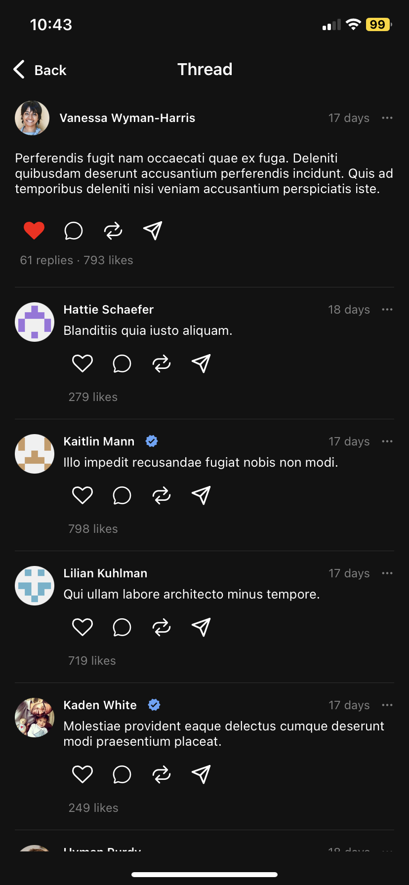
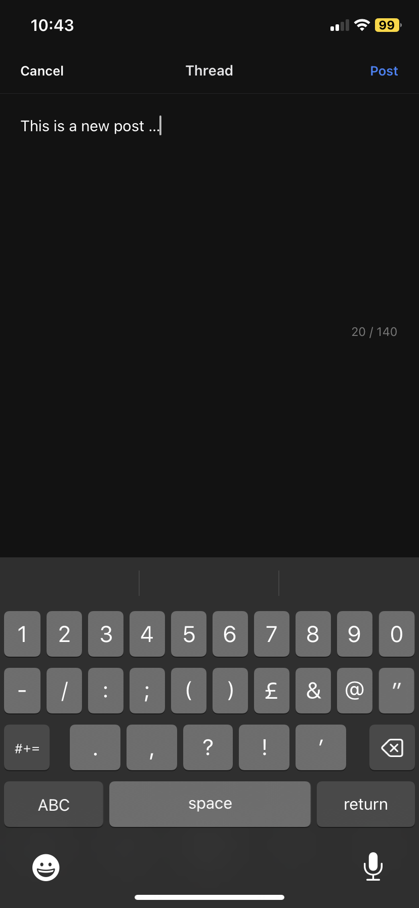

## threads-app-react-native
This is a UI clone of the Threads app by Meta (facebook) built with react native and expo router. This is a modified source code and the original source code is at https://github.com/betomoedano/React-Native-Threads-Clone and the tutorial is at https://youtu.be/VK-XkNcvLjM

## Screenshots

<!-- 





 -->


## Project setup
```
npm install
```

### Compiles and hot-reloads for development
```
npx expo start
```